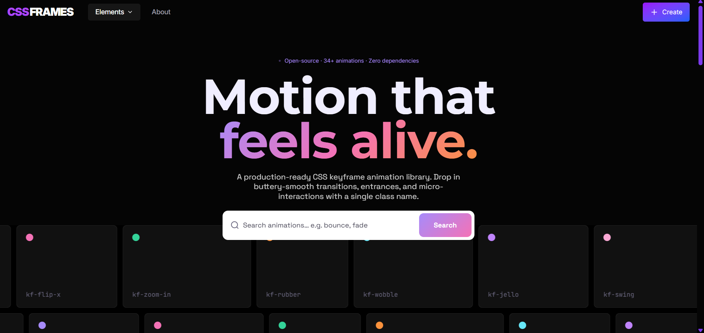
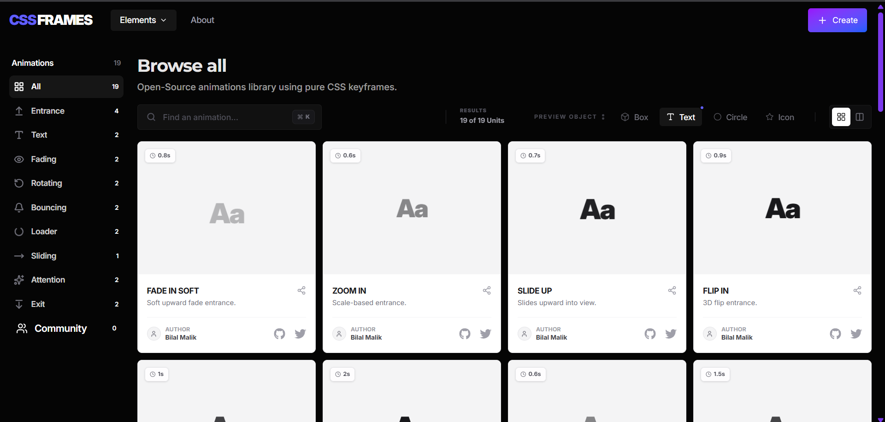

# <a href="https://cssframes.vercel.app" target="_blank">CSSFrames - Animations using Pure CSS Keyframes</a>

**CSSFrames** is an open-source motion system for building high-performance UI animations using pure CSS keyframes.
It provides a curated library of **pre-engineered motion presets** designed to replace inconsistent, ad-hoc animation usage across modern web apps.
Built for **performance, consistency, and developer speed** - with no JavaScript animation runtime, no animation libraries, and no layout thrashing.

<p align="left">
  <a href="./LICENSE">
    
  </a>
  
  
  <a href="https://github.com/byllzz">
    
  </a>
    <a href="https://github.com/byllzz/cssframes/releases">
     
  </a>
</p>

<br />

[](https://cssframes.vercel.app)

<!-- preview image -->



⭐ **Star the repo if you like it — it helps the project grow.**

---

# Features

<p align="left">
✔️ Pure CSS Keyframe Animations<br>
✔️ GPU-Friendly Motion Primitives<br>
✔️ Zero JavaScript Animation Runtime<br>
✔️ Tailwind-Compatible Animation System<br>
✔️ Curated Motion Presets<br>
✔️ Live Interactive Preview Grid<br>
✔️ Creator Suite for Building Custom Presets<br>
✔️ Instant Export to CSS @keyframes<br>
✔️ Theater Mode for Focused Previewing<br>
✔️ Community Motion Ecosystem<br>
✔️ Performance-First Architecture<br>
✔️ Open Source MIT License<br>
✔️ Designed for Production UI Work
</p>

---

## How It Works

- Choose a motion preset from the library or community collection.
- Preview the animation instantly on different UI elements.
- Export production-ready output as:
  - CSS `@keyframes`
  - Tailwind animation classes
  - duration and easing metadata
- Use the generated motion in your app with minimal setup.
- All animations rely on compositor-friendly properties like `transform` and `opacity`.

---

## Core Philosophy

- **Motion is Functional**
  Animations are not decoration. They communicate state, hierarchy, and feedback.

- **Performance First**
  Every animation is built to:
  - avoid layout shifts
  - avoid paint recalculations
  - stay GPU composited

- **Composable System**
  Animations are modular building blocks, not one-off effects.

- **Design Consistency**
  All motion follows a unified rhythm and timing system.

---

## System Architecture

CSSFrames is structured into three layers:

### 1. Motion Presets Layer
Predefined animation objects for:
- buttons
- loaders
- entrances
- cards
- icons
- shapes

### 2. Rendering Engine
React-based preview system with:
- live CSS injection
- dynamic keyframe binding
- preview type mapping

### 3. Export Layer
Generates production-ready output:
- CSS keyframes
- Tailwind classes
- duration configs

---

## Animation Categories

CSSFrames includes curated motion presets across:

### Buttons
- micro-interaction feedback
- hover and click states
- error responses

### Loaders
- skeleton shimmer
- pulse rings
- spin systems

### Entrances
- slide, fade, and blur reveals
- staggered motion

### Text
- typewriter effects
- glitch systems
- reveal animations

### Cards
- glow systems
- floating motion
- shimmer sweeps

### Icons
- float dynamics
- stroke-draw animations
- alert motion

### Shapes
- morphing blobs
- geometric transitions
- pulse glow systems

---

## Tech Stack

### Frontend
- React.js (Vite)
- Tailwind CSS
- JavaScript (ES6+)

### UI & Icons
- Lucide React
- Custom UI components
- Monaco Editor

### Animation System
- Native CSS3 keyframes
- GPU-composited transforms
- Dynamic style injection

### Code Tools
- Prettier
- Prism.js

### Deployment
- Vercel
- Static-first architecture


## Installation & Setup

### Requirements
- Node.js
- Browser (Chrome / Edge / Firefox)
- Tailwind CSS knowledge
- A basic understanding of CSS keyframes

### Clone the Repository
```bash
git clone https://github.com/byllzz/cssframes.git
cd cssframes
npm install
npm run dev
```

## Guidelines

- Keep animations GPU-friendly
- Avoid layout-triggering properties
- Ensure Tailwind compatibility
- Provide both CSS and metadata
- Include preview examples when possible

<br>


# Contributing

We welcome contributions from developers and motion designers.

## Workflow

```bash
git checkout -b motion/style-redefined-UI
```

# License 📄

This project is licensed under the MIT License - see the [LICENSE.md](./LICENSE) file for details.

